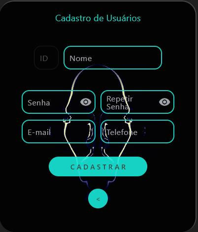

# System Login Flet/Python
Sistema Completo de Login com BD SQlite3

Um sistema completo de Login vinculado a um banco de Dados onde é possivel criar os usuarios que terão acesso ao seu sistema.

O sistema conta com um visual realista, tornando a experiencia do usuario fascinante. O projeto conta com sons e imagens tornando a experiencia do usuario inesquecivel.

## Janela Login

- A página principal do projeto possui um visual tridimensional, com a possibilidade de ligar e desligar o sistema de audio, assim como tambem estar fechado o sistema e navendo entre as demais paginas de criação de novos usuarios ou recuperação de senha por email;
- Toda a validação de senha e ID digitadas esta vinculado ao usuarios cadastrados no banco de dados

## Janela de Cadastro

- Na página de cadastro de novos usuarios, existem a validações de senha para que o usuario repita a senha digitada para manter a segurança do sistema;
- Tambem foi inplanto o sistema de validação para e-mail, garantido que o usuario cadastre um email valido para futura recuperação de senha
- A entrada do numero de telefone tambem esta codigicada para garantir que ao incluir o numero o mesmo ja aparece conforme a codificação de numero de celular
- Após confirmar os dados, toda a informação é inserida em um banco de Dados SQlite 3.

## Janela de Recuperação de Senha

  - O sistema possui um função de recuperação de senha caso o usuário tenha esquecido sua senha;
  - O mesmo utiliza a biblioteca do proprio Outlook e do sistema para disparar os e-mail de recuperação de senha, podendo ser alterado para outra biblioteca conforme o usuário deseje.
 
 ## Como Instalar

 1. Baixe todos os arquivos, e os insira em uma mesma pasta.
 2. Abra a pasta utilizando o VSCode ou outro software de sua preferencia.
 3. Abra o arquivo "janela_login.py"
 4. instale as bibliotecas contidas no arquivo requirementes.txt através de "pip install -r requirements.txt"
 5. execute o arquivo "janela_login.py" .

## Bibliotecas Utilizadas

- sqlite3
- flet
- re
- pygame
- time

Para contribuir, siga os passos acima e envie um pull request! 
